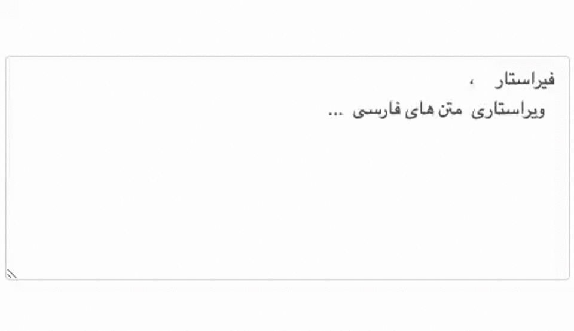

	

		
	

	<h1 align="center">Firastar</h1>
	
Write your best with Firastar in Browser.

 

## Installation
- Chrome
    1. [Download](https://github.com/Firastar/firastar-extension/releases) latest release bundle
    2. Open chrome and activate the developer mode from `chrome://extensions/`
    3. Click on `Load unpacked` button and choose the address of extension root directory.

## Todo

- [ ] Release on Chrome Web Store 
- [ ] Disabled when text is not Persian
- [ ] Disabled when text no need edition
- [ ] Settings popup

## Known Issues
- Extension Warning Popup on Windows ([Solution](https://github.com/Ceiridge/Chrome-Developer-Mode-Extension-Warning-Patcher))

## Contributing

Thank you for your interest in contributing! Please feel free to put up a PR for any issue or feature request.

## Give me a Star

If you think this project is helpful just give me a ⭐️ Star is enough because i don't drink coffee 😃

## License

This project is licensed under the MIT License - see the [LICENSE.md](https://github.com/Firastar/firastar-extension/blob/master/LICENSE) file for details.